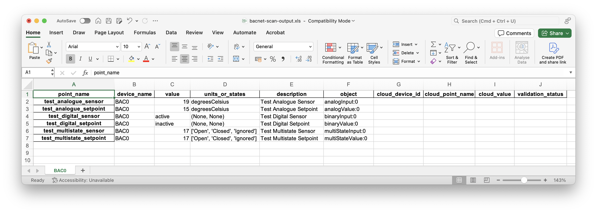
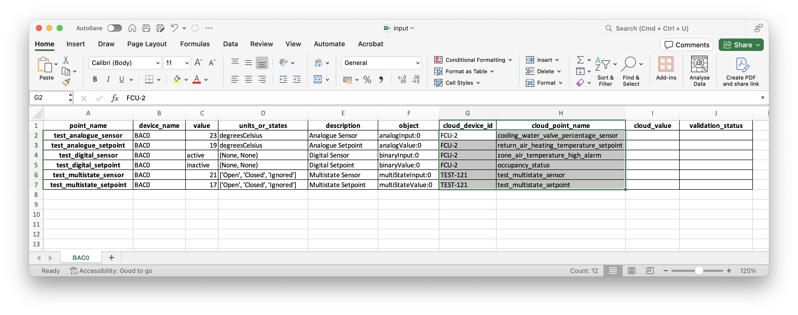
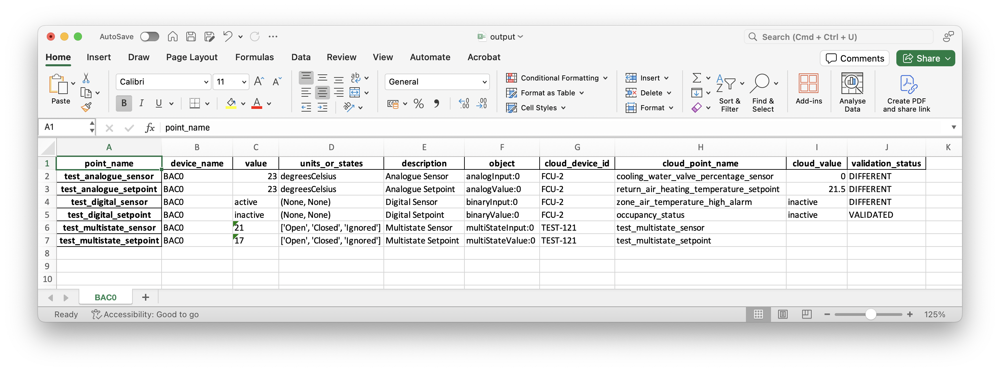

## UDMI commissioning tool

The aim of the UDMI commissioning tool is to compare the values 
of data points from the local network (BACnet or Modbus values)
to the values appearing in GCP PubSub.

The UDMI commissioning tool accepts an input file with a list
of BACnet object names or Modbus registers numbers and a list
of UDMI device and point names, and validates that their values
are the same.

### Installation

This tool depends on the BAC0 python library, which has been
tested to work well with Python 3.9 and Python 3.10. 
It is therefore recommended to create a Python 3.9 or 3.10 
virtual environment first:

```
python3.9 -m venv py39
```

and then activate this environment

```
source py39/bin/activate
```

After this, install the python library dependencies:

```
python3 -m pip install -r requirements.txt
```

### Use


#### Input file generation from BACnet scan

The first step is to generate a UDMI validation input file.
This can be achieved by running the `bacnet-scan.py` tool.

The `bacnet-scan` help is shown below.

```
% ./bacnet-scan.py -h
 ____    _    ____            _
| __ )  / \  / ___|_ __   ___| |_      ___  ___ __ _ _ __
|  _ \ / _ \| |   | '_ \ / _ \ __|____/ __|/ __/ _` | '_ \
| |_) / ___ \ |___| | | |  __/ ||_____\__ \ (_| (_| | | | |
|____/_/   \_\____|_| |_|\___|\__|    |___/\___\__,_|_| |_|


usage: bacnet-scan.py [-h] [-v] [-x EXPORT] [-a ADDRESS]

optional arguments:
  -h, --help            show this help message and exit
  -v, --verbose         increase the verbosity level
  -x EXPORT, --export EXPORT
                        spreadsheet file name for scan results (optional), supported extensions are .xlsx and .ods
  -a ADDRESS, --address ADDRESS
                        IP address of BACnet interface (optional)
```

An example command line invocation of the `bacnet-scan.py` tool is the following:

```
./bacnet-scan.py -x bacnet-scan-output.xls
```

If needed, specify the IP address of the network device that is connected to the BACnet IP network (for instance 
192.168.1.100 in the example below):

```
./bacnet-scan.py -x bacnet-scan-output.xls -a 192.168.1.100
```

This process generates an output `.xlsx` file that should be used as input for the next process.

See below the content of the output `.xlsx` file.



Other spreadsheet format and extensions that can be used are `.xls` and `.ods`.

#### Addition of cloud point names

The output file of the previous step should be used as the input file of the `udmi-commissioning.py` tool.

For this purpose, open it in a spreadsheet program like Excel, LibreOffice or Google Sheets and add the cloud device ID 
and cloud point name, as shown in the image below.



Once the file includes all the target points needed for commissioning validation, invoke the `udmi-commissioning.py` tool:

```
./udmi-commissioning.py -p GCP-PROJECT-NAME -s GCP-PUBSUB-SUBSCRIPTION -i input.xlsx -o output.xls
```

More options for `udmi-commissioning.py` are shown below:

```
% ./udmi-commissioning.py -h
 _   _ ____  __  __ ___
| | | |  _ \|  \/  |_ _|
| | | | | | | |\/| || |
| |_| | |_| | |  | || |
 \___/|____/|_|  |_|___|


                               _         _             _
  ___ ___  _ __ ___  _ __ ___ (_)___ ___(_) ___  _ __ (_)_ __   __ _
 / __/ _ \| '_ ` _ \| '_ ` _ \| / __/ __| |/ _ \| '_ \| | '_ \ / _` |
| (_| (_) | | | | | | | | | | | \__ \__ \ | (_) | | | | | | | | (_| |
 \___\___/|_| |_| |_|_| |_| |_|_|___/___/_|\___/|_| |_|_|_| |_|\__, |
                                                               |___/

usage: udmi-commissioning.py [-h] [-v] [-p PROJECT] [-s SUB] [-i INPUT] [-o OUTPUT] [-a ADDRESS] [-t TIMEOUT]

optional arguments:
  -h, --help            show this help message and exit
  -v, --verbose         increase the verbosity level
  -p PROJECT, --project PROJECT
                        GCP project id (required)
  -s SUB, --sub SUB     GCP PubSub subscription (required)
  -i INPUT, --input INPUT
                        input file containing the point list (optional, the default is input.xlsx, accepted extensions are .xlsx and .ods)
  -o OUTPUT, --output OUTPUT
                        sheet file name for output results (optional, the default is output.xlsx, accepted extensions are .xlsx and .ods)
  -a ADDRESS, --address ADDRESS
                        IP address of BACnet interface (optional)
  -t TIMEOUT, --timeout TIMEOUT
                        time interval in seconds for which to receive messages (optional, default=3600 seconds, equating to 1 hour)
```

Leave the tool to run until it has discovered all the target points in GCP PubSub.
Once satisfied with the number of validated points, interrupt the program by pressing CTRL+C.
This key combination will be intercepted by the program to save the output file.

The content of the output spreadsheet file will now include the commissioning validation output, as shown below:



"""
## sheet2mangojson.py:

The aim of the `sheet2mangojson.py` tool is to convert structured spreadsheet data (containing BACnet scan results and BDNS/DBO mappings) directly into the Mango Automation JSON configuration files.

The tool adheres to specific UDMI driver versions (supporting both **v5.4.*** and **v5.3.*** formats) and handles generating BACnet Data Sources and UDMI Publisher configurations, including proxy devices and key generation.

### Installation

This tool depends on several standard Python libraries. It is highly recommended to create and activate a Python virtual environment first:

1. **Create a Virtual Environment (Recommended):**

   ```
   python3 -m venv venv
   source venv/bin/activate
   ```

2. **Install Required Python Packages:**

   ```
   python3 -m pip install -r requirements.txt
   ```

3. **System Dependencies (Linux/Debian/Ubuntu Only):**
   Since the script uses a graphical interface (Tkinter) in GUI mode, you may need to install the following system dependency first:

   ```
   sudo apt install python3-tk
   ```

### Use

The script offers two main modes for execution:

#### Interactive GUI Mode (Default)

Run the script without any command-line arguments to launch the graphical configuration window. This allows you to set all parameters via a structured form.

```
./sheet2mangojson.py
```

#### Command Line Interface (CLI) Mode

Pass the required input and output arguments to run the script non-interactively.

```
./sheet2mangojson.py -i <input_file> -o <output_prefix> [optional_arguments]
```

### Command Line Options (`-h` Help)

Running `./sheet2mangojson.py -h` will display all available options and defaults.

#### Required Arguments

The script **must** be provided these two arguments when run in CLI mode:

| **Flag** | **Argument Name** | **Description** |
| :--- | :--- | :--- |
| `-i`, `--input` | `<path>` | **[REQUIRED]** Input spreadsheet file path (e.g., `scan.xlsx`). |
| `-o`, `--output` | `<prefix>` | **[REQUIRED]** Output file prefix (e.g., `site_config` generates `site_config_bacnet_config.json`, etc.). |

#### Optional Arguments (Defaults)

| **Flag** | **Argument Name** | **Description** | **Default Value** |
| :--- | :--- | :--- | :--- |
| `-v`, `--verbose` | `[action: store_true]` | Enable detailed debug output for increased logging. | `False` |
| `--udmi-version` | `5.4.*` or `5.3.*` | Select the target Mango UDMI driver version. | `5.4.*` |
| `-u`, `--unique` | `[action: store_true]` | Create a unique BACnet Data Source per device found in the spreadsheet. | `True` |
| `--ds-enabled` | `True` or `False` | Set the BACnet Data Source's initial 'enabled' status. | `True` |
| `-l`, `--localdevice` | `<ID>` | ID of the BACnet Local Device in Mango. | `98777` |
| `-b`, `--broadcast` | `<IP>` | Broadcast address for the BACnet Local Device. | `255.255.255.255` |
| `--timeout` | `<ms>` | BACnet Local Device 'timeout' in milliseconds. | `30000 ms` |
| `--retries` | `<count>` | BACnet Local Device 'retries' count. | `0` |
| `--segtimeout` | `<ms>` | BACnet Local Device 'segTimeout' in milliseconds. | `10000 ms` |
| `-p`, `--publisher` | `<name>` | Name for the Mango UDMI publisher device. | `CGWV-1` |
| `-j`, `--project` | `<ID>` | GCP project ID for the UDMI publisher. | `bos-platform-prod` |
| `-g`, `--region` | `<region>` | GCP region for the UDMI publisher. | `us-central1` |
| `-r`, `--registry` | `<ID>` | IoT Core registry ID for the UDMI publisher. | `ZZ-ABC-DEF` |
| `-s`, `--site` | `<name>` | IoT Core site name for the UDMI publisher. | `ZZ-ABC-DEF` |
| `--hostname` | `<host>` | UDMI Hostname (used for V5.4.* templates). | `mqtt.bos.goog` |
"""